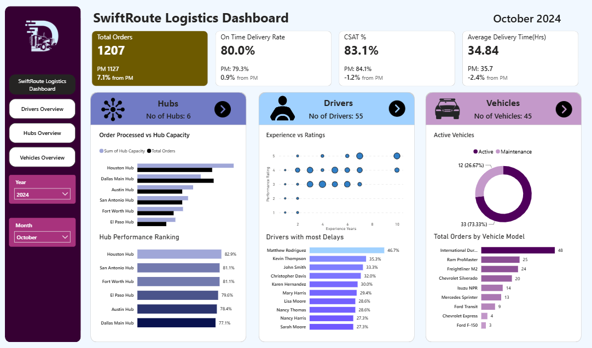
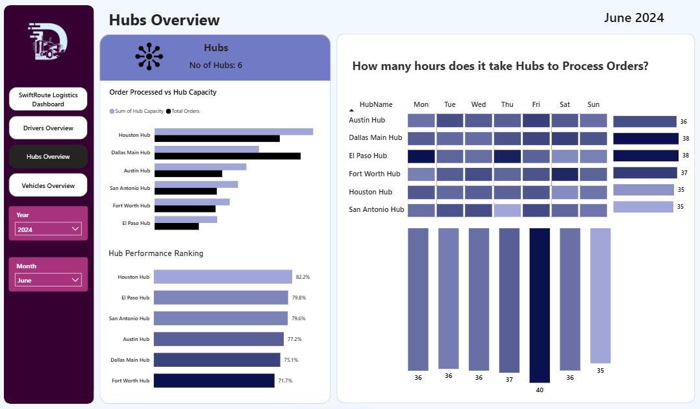
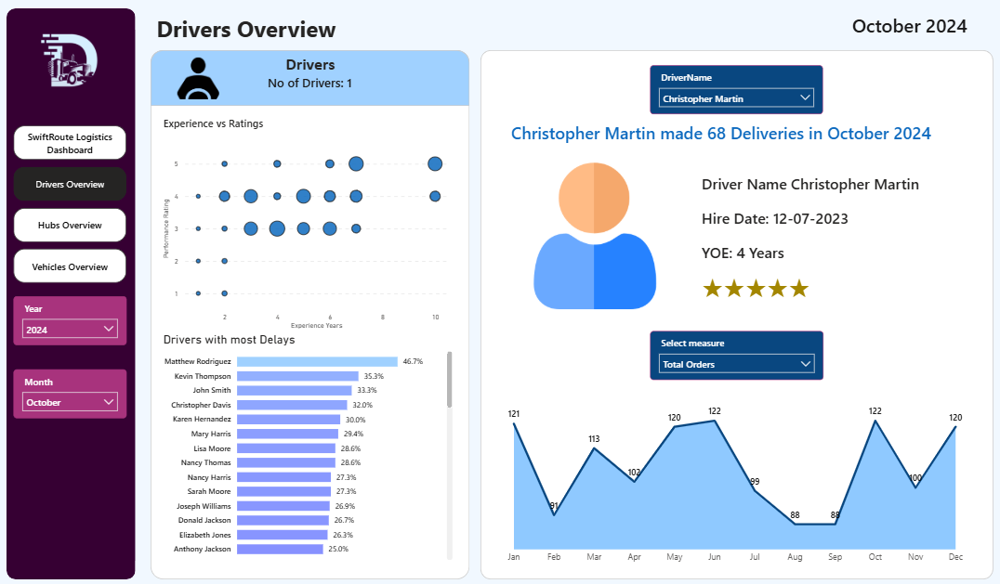
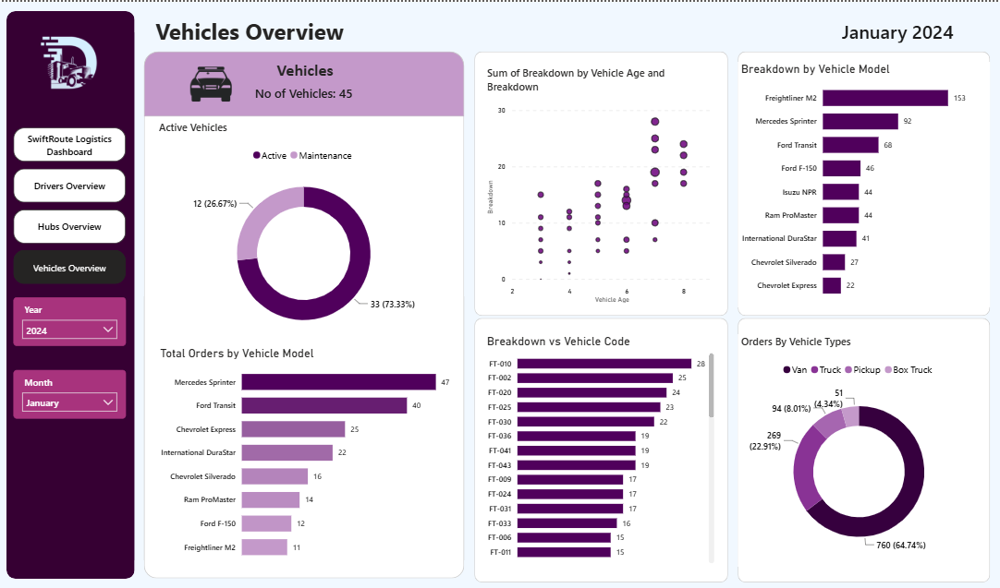

# SwiftRoute Logistics Dashboard

> An interactive, 4-page Power BI dashboard that tracks delivery performance, hub capacity, driver quality and fleet health for a logistics company.




---

## Overview

**SwiftRoute** is a logistics company that moves packages from hubs to customers using its own drivers and vehicles. This project turns **two years of order data (2023–2024)** into a dynamic dashboard where a **Year** and **Month** filter updates every KPI and chart.

The report has **4 pages**: Overview (landing page), Hubs Overview, Drivers Overview and Vehicles Overview. Each page is linked with navigation buttons, and each KPI compares the selected month with the **previous month** (MoM %).

---

## Problem Statement

Management had no single view of how the delivery network performs. They needed to answer:

- How many orders are we delivering, and how does this month compare with last month?
- Are packages delivered **on time**, and are customers **satisfied** (CSAT)?
- Which **hubs** are over or under capacity, and which perform best?
- Which **drivers** cause the most delays, and does **experience** improve ratings?
- How much of the **fleet** is active, and which vehicles or models break down most?

---

## Dataset

Four CSV files 

| Table | Role | Description |
|-------|------|-------------|
| **Orders** | Fact table | About **27,979 rows** and **15 columns**; one row per order (Order ID, Order Date, Actual Delivery Date, Order Status, Is Delayed, Is On Time, Delay Reason, Hub Name, Driver ID/Name, Vehicle Name/Type, Customer Satisfaction Score, Delivery Time Hours, Hub Processing Time Hours) |
| **Hubs** | Dimension | 6 hubs with Hub ID, Hub Name and Hub Capacity |
| **Drivers** | Dimension | 55 drivers with Driver ID, Name, Employment Type, Hire Date, Experience Years, Performance Rating |
| **Vehicles** | Dimension | Vehicle Code, Model, Purchase Date, Status (Active / Under Maintenance), Breakdown count, Maintenance alerts |

**Period:** January 2023 to December 2024

**Data notes:**
- `Is Delayed` and `Is On Time` are opposite flags; `Delay Reason` is filled only for delayed orders, so blanks are expected.
- `Order Status` is either Delivered or Cancelled.
- Delay reasons include package sorting, road conditions, weather, hub processing, vehicle breakdown and incorrect address.

---

## 🛠️ Tools and Technologies

| Tool | Used for |
|------|----------|
| **Power BI Desktop** | Report design, visuals, navigation, tooltips |
| **Power Query** | Data quality checks (column quality and distribution) |
| **DAX** | Measures, calculated columns, date table, time intelligence |
| **CSV files** | Source data |
| **Flaticon** | Icons and logo used in the design |

---

## Methods (Steps)

1. **Import data:** loaded the 4 CSV files with *Get Data → Text/CSV*.
2. **Validate data:** checked row counts, headers and data types (especially **date columns**), and confirmed **0% errors** in Power Query's column quality view.
3. **Build the data model (star schema):** `Orders` is the fact table; `Hubs`, `Drivers`, `Vehicles` and `Date` are dimensions. All relationships are one-to-many with single-direction filters.

   | From (one) | To (many) | Joined on |
   |------------|-----------|-----------|
   | Hubs | Orders | Hub Name |
   | Drivers | Orders | Driver ID |
   | Vehicles | Orders | Vehicle Code = Vehicle Name |
   | Date | Orders | Date = Order Date |

4. **Create a Date table** for time intelligence:
   ```dax
   Date Table = CALENDAR ( MIN ( Orders[Order Date] ), MAX ( Orders[Order Date] ) )
   ```
   Added columns: `Year`, `Month` (sorted by `Month Number`), `Month Abbr`, `Day` (sorted by `Day Number`, Monday = 1).
5. **Write DAX measures** (see below).
6. **Design the canvas:** custom size **1450 × 850**, light blue background, dark left navigation panel with logo, Year/Month single-select dropdown slicers, and a dynamic "Month Year" label.
7. **Build the 4 pages** from the business requirements, then add page-navigation buttons and edit slicer interactions so profile visuals ignore unrelated filters.

### Key DAX Measures

```dax
-- Orders and month-over-month
Total Orders = COUNT ( Orders[Order ID] )

Previous Month Orders =
CALCULATE ( [Total Orders], DATEADD ( 'Date Table'[Date], -1, MONTH ) )

MoM Order % =
DIVIDE ( [Total Orders] - [Previous Month Orders], [Previous Month Orders] )
```

```dax
-- On-time delivery rate
Delivered Orders =
CALCULATE ( [Total Orders], Orders[Order Status] = "Delivered" )

On Time Delivered Orders =
CALCULATE ( [Total Orders], Orders[Order Status] = "Delivered", Orders[Is On Time] = TRUE () )

On Time Delivery Rate =
DIVIDE ( [On Time Delivered Orders], [Delivered Orders] )

Delayed Orders =
CALCULATE ( [Total Orders], Orders[Order Status] = "Delivered", Orders[Is On Time] = FALSE () )

Delayed Delivery Rate =
DIVIDE ( [Delayed Orders], [Delivered Orders] )
```

```dax
-- Customer satisfaction (score of 4 or 5 = satisfied)
CSAT Satisfied Orders =
CALCULATE ( [Total Orders], Orders[Customer Satisfaction Score] >= 4 )

CSAT % =
DIVIDE ( [CSAT Satisfied Orders], [Total Orders] )

Avg Delivery Time (Hours) =
AVERAGE ( Orders[Delivery Time Hours] )
```

The same **Previous Month** and **MoM %** pattern (`CALCULATE` + `DATEADD`) is reused for on-time rate, CSAT and average delivery time.

```dax
-- Dynamic driver star rating (filled + empty stars)
Star Rating =
REPT ( UNICHAR ( 9733 ), AVERAGE ( Drivers[Performance Rating] ) )
    & REPT ( UNICHAR ( 9734 ), 5 - AVERAGE ( Drivers[Performance Rating] ) )

-- Vehicle age (calculated column)
Vehicle Age = DATEDIFF ( Vehicles[Purchase Date], TODAY (), YEAR )
```

Other items: `Number of Hubs / Drivers / Vehicles` (count of IDs), dynamic text titles using `SELECTEDVALUE`, and a **field parameter** ("Select Measure") to switch a chart between *Total Orders* and *On Time Delivery Rate*.

---

## 💡 Key Insights

> Insights below are from the months shown in the walkthrough. Values change with the Year/Month filter, so confirm them against your own report before publishing.

**Overall performance**
- Monthly volume is steady at roughly **1,100–1,200 orders** (about 28K orders over 24 months).
- **On-time delivery** sits around **78–81%**, and month-to-month changes are small (e.g., 80.8% vs 81.6% in the previous month).
- **CSAT is about 84%**, meaning most customers rate deliveries 4 or 5.

**Hubs**
- **Dallas Main Hub** processed **283 orders against a capacity of 250**, so it runs above capacity. Houston processed 275 against 380, so it is under-utilised.
- **El Paso** handles far fewer orders (about 129) but still delivers with a high on-time rate, so it has room to take more volume.
- Hub rankings by on-time rate **change month to month**; the lowest performer in the sample month was about **76.7%**.

**Drivers**
- **More experience means higher ratings.** Drivers with 1–4 years show ratings from 1 to 5, while drivers with 7–10 years mostly sit at 3–5.
- The **top-10 delayed drivers change every month**, so coaching should use monthly monitoring rather than a one-time review.

**Vehicles**
- Around **73% of the fleet is active** (33 active vs 12 under maintenance in the month shown), and the maintenance count stays high across months. Returning these vehicles to service could raise on-time delivery.
- **Older vehicles break down more:** vehicles around 8 years old show 17–24 breakdowns.
- **Freightliner M2** has the most breakdowns (**153**), which flags a reliability issue with that model.
- **Vans** deliver the most orders by vehicle type; **Mercedes** leads by vehicle model.

---

## Dashboard

The report has **4 interactive pages**. Every page has **Year** and **Month** slicers and a left navigation panel.

### Page 1: Overview (landing page)


| Section | Visual | Type |
|---------|--------|------|
| KPIs | Total Orders, On-Time Delivery Rate, CSAT %, Avg Delivery Time (Hrs), each with previous month and MoM % | **Multi-row cards** with reference labels |
| Hubs | Number of Hubs | **KPI card** |
| Hubs | Order Processed vs Hub Capacity | **Clustered column chart** |
| Hubs | Hub Performance Ranking (by on-time rate) | **Ranked bar chart** (gradient colour) |
| Drivers | Number of Drivers | **KPI card** |
| Drivers | Experience vs Rating | **Scatter plot** (bubble size = experience) |
| Drivers | Drivers with Most Delays (Top 10) | **Bar chart** with Top N filter |
| Vehicles | Number of Vehicles | **KPI card** |
| Vehicles | Active Vehicles | **Donut chart** by vehicle status |
| Vehicles | Total Orders by Vehicle Model | **Bar chart** (gradient) |
| Filters | Year, Month, "Month Year" label | **Drop-down slicers**, **dynamic text** |

### Page 2: Hubs Overview


| Visual | Type |
|--------|------|
| Number of Hubs | KPI card |
| Order Processed vs Hub Capacity | Clustered column chart |
| Hub Performance Ranking | Ranked bar chart |
| Hub Order Processing Time (Hours), hub × weekday | **Matrix** with conditional-format heat map |
| Average hours by weekday and by hub | **Column and bar charts** with gradient colours and tooltips |

### Page 3: Drivers Overview


| Visual | Type |
|--------|------|
| Number of Drivers | KPI card |
| Experience vs Rating | Scatter plot |
| Drivers with Most Delays | Bar chart (Top 10) |
| Driver Profile Summary: name, hire date, years of experience, **star rating**, "X made N deliveries in Month Year" | **KPI cards with dynamic DAX text** + driver-name slicer |
| Monthly Trend of Orders (switchable to On-Time Delivery Rate) | **Area** driven by a **field parameter** |

### Page 4: Vehicles Overview


| Visual | Type |
|--------|------|
| Number of Vehicles | KPI card |
| Active Vehicles | Donut chart |
| Total Orders by Vehicle Model | Bar chart |
| Vehicle Age vs Breakdown | **Scatter plot** (bubble size = breakdowns) |
| Breakdown by Vehicle Code | Bar chart |
| Breakdown by Vehicle Model | Bar chart |
| Orders by Vehicle Type | Donut chart |

**Interactivity:** page-navigation buttons, back-to-home buttons, drop-down slicers, cross-filtering, edited slicer interactions and tooltips.

---

## Results

The finished dashboard gives SwiftRoute managers a single, filterable view of the operation and answers each business question from the problem statement:

| Business Question | Result |
|-------------------|--------|
| How many orders, and how is the trend? | Any month in 2023–2024 shows total orders with the previous month and **MoM %**; volume is stable at about 1,100–1,200 orders per month |
| Are we on time and are customers happy? | On-time delivery is about **78–81%** and CSAT about **84%**; both are tracked against the previous month |
| Which hubs are over or under capacity? | **Dallas Main Hub** runs above capacity, while **Houston** and **El Paso** have spare capacity, so workload can be rebalanced |
| Which drivers need attention? | A **monthly Top-10 list of delayed drivers** and an experience-vs-rating view show where coaching is needed |
| How healthy is the fleet? | About a quarter of vehicles are **under maintenance**; older vehicles and the **Freightliner M2** model break down most |

### Recommendations
- **Shift orders** from over-capacity hubs to under-used hubs nearby.
- **Coach the drivers** who appear repeatedly in the Top-10 delay list, and pair newer drivers with experienced ones.
- **Bring vehicles under maintenance back into service faster** and plan replacement for aging, high-breakdown models.
- **Watch on-time rate and CSAT monthly** so a drop is caught early.

---

## Conclusion

This project shows how a well-designed **star schema**, a proper **date table** and a small set of reusable DAX patterns (`CALCULATE` + `DATEADD`) can turn raw order data into a decision-ready dashboard. The results show that delivery performance is fairly steady, but that **hub capacity imbalance**, **driver experience** and **fleet reliability** are the main levers for reducing delays. With the dashboard, SwiftRoute can move from reacting to late deliveries to spotting the hub, driver or vehicle behind them.

---

## Future Work

- **Delay root-cause analysis:** add a visual and tooltip breaking delays down by `Delay Reason` (sorting, weather, roads, hub processing, vehicle breakdown, wrong address).
- **Forecasting:** predict monthly order volume to plan hub capacity and driver staffing.
- **Cost and revenue metrics:** add cost per delivery and profit per hub if financial data becomes available.
- **Map view:** show hubs and delivery locations geographically.
- **Predictive maintenance:** use age, breakdown and maintenance history to flag vehicles at risk of failure.
- **Row-Level Security:** let each hub manager see only their own hub.
- **Publish to Power BI Service** with scheduled refresh and email alerts for KPI drops.
- **Mobile layout** for managers on the go.

---

## How to Run This Project

**Requirements:** Power BI Desktop (free, Windows). A `.pbix` file cannot be opened in a browser or on macOS directly.

**Option A: Open the finished report**
1. Clone or download this repository:
   ```bash
   git clone https://github.com/KajalGupta-tech/swiftRoute-logistics-dashboard.git
   ```
2. Open `SwiftRoute_Dashboard.pbix` in Power BI Desktop.
3. If Power BI shows a data-source error: **Home → Transform data → Data source settings → Change Source**, and point each table to the matching CSV in the `data/` folder.
4. Click **Home → Refresh**, then use the **Year** and **Month** slicers and the navigation buttons.

**Option B: Rebuild it yourself**
1. Download the 4 CSV files (`Orders`, `Hubs`, `Drivers`, `Vehicles`) from the link above.
2. Import them via **Get Data → Text/CSV** and confirm all date columns have the **Date** data type.
3. Create the relationships and the `Date Table` as shown in [Methods](#-methods-steps).
4. Add the DAX measures, then build each page following the visual tables in [Dashboard](#-dashboard).

**Folder structure**
```text
SwiftRoute-Logistics-Dashboard/
├── README.md
└── dashboard/
    ├── swiftroot-logistics-dashboard.pbix
├── data/          # Orders, Hubs, Drivers, Vehicles CSVs
└── Business_Requirements.docx
└── images
    ├── screenshots/   # dashboard overviews images
    └── png-images/    # flaticons images
```

---

## 👤 Author & Contact

**Kajal Gupta**
*Data Analyst | Power BI · DAX · SQL · Excel*

- 📧 Email: [projects.kajalgupta@gmail.com](mailto:projects.kajalgupta@gmail.com)
- 💼 LinkedIn: [linkedin.com/in/kajalgupta19](https://linkedin.com/in/kajalgupta19)
- 🐙 GitHub: [github.com/kajalgupta-tech](https://github.com/kajalgupta-tech)
- 🌐 Portfolio: [https://kajalgupta-tech.github.io/](https://kajalgupta-tech.github.io/)

If you found this project useful, please give the repository a star!
